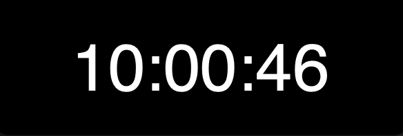
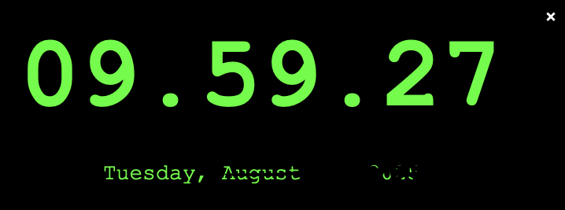

# Digital Clock Project

A 🕰️ sleek and 🎨 user-friendly digital clock built with 🐍 **Python** and Tkinter, offering both a basic clock and an enhanced version with drag-and-drop functionality and a blinking colon separator. Designed to display real-time time and date updates, this project showcases my skills in Python, Tkinter, and user interface development.

## Features

🕰️ Displays time in **HH:MM:SS** format (Basic Version).  
🎨 Enhanced version with **drag-and-drop** functionality.  
⚡ Always on top feature for the clock to stay visible.  
🖥️ Borderless window for a minimalist design.  
🔲 Blinking colon separator effect in the enhanced version.  
📅 Displays date in **Day, Month Date, Year** format (Enhanced Version).

## Tech Stack

🐍 **Language**: Python 3.x  
🖼️ **GUI**: Tkinter  
📚 **Libraries**:  
- **time**: Time formatting and real-time updates.  

🔨 **Tools**: Git, Python CLI

### Screenshots

- **Basic Digital Clock**:
  
  
  
  
          *Clock 1 (Basic Version)*  

- **Enhanced Digital Clock**:
  
  

  
          *Clock 2 (Enhanced Version)*  

## Installation

### Prerequisites

🐍 **Python 3.x** (includes Tkinter)  

### Steps

1. Clone the repository:  
   `git clone https://github.com/SAMIR897/Python_projects.git`  
   `cd Python_projects/Basic_projects/3. Digital Clock`

2. Run the clock:
   - For the basic clock:  
     `python Clock.py`
   - For the enhanced clock with drag-and-drop:  
     `python Clock2.py`

## How It Works

1. **Basic Version**:
   - The time is fetched using `time.strftime("%H:%M:%S")`, and the `time_label` is updated every second using `root.after()`.
   
2. **Enhanced Version**:
   - The enhanced clock also displays the date using `time.strftime("%A, %B %d, %Y")`.
   - The clock window is **always on top** using `root.attributes('-topmost', True)`.
   - The window is **borderless** using `root.overrideredirect(True)`.
   - Drag functionality is enabled by binding mouse events to the window's movements, letting the user drag it around the screen.
   - The **blinking colon** effect is achieved by alternating between `:` and `.` for the time separator every second.

## Error Handling

🚫 Rejects invalid inputs or actions that might disrupt the clock's functioning.  
✅ Ensures the clock updates properly with accurate time and date information.

## Why This Project?

Showcases my skills in:

- 🐍 Python and Tkinter for developing intuitive apps.  
- 🖥️ UI/UX design with features like drag-and-drop and blinking effects.  
- ⏱️ Handling real-time updates and system functionalities in Python.  
- 💼 A perfect addition to my portfolio for showcasing Python development skills.

## Contributing

🚀 Contributions welcome! To contribute:

1. Fork: [https://github.com/SAMIR897/Python_projects](https://github.com/SAMIR897/Python_projects)  
2. Branch: `git checkout -b feature/your-feature`  
3. Commit: `git commit -m "Add feature"`  
4. Push: `git push origin feature/your-feature`  
5. Open a pull request.

See **CONTRIBUTING.md** for details.

## License

🔓 **MIT License** allows free use and modification.
